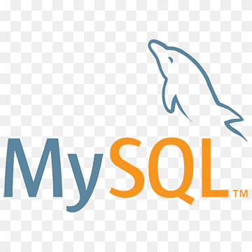

<h1 align="left">Ricardo de Freitas</h1>
<h3 align="left">Tech Leader | Desenvolvedor Sênior</h3>

<blockquote>Profissional na área de TI há mais de dez anos no mercado. Possuindo experiência em desenvolvimento
e análise de sistemas de diversas áreas como: Gestão Empresarial (ERP), Relacionamento com Cliente
(CRM), Seguros para Automóveis, Callcenter e Automação Comercial e etc.</blockquote>

Linkedin: https://www.linkedin.com/in/ricardo-freitas-araujo/

<h3>Hard Skills</h3>

Languages:

  

Cloud and Infrastructure:

Databases:

